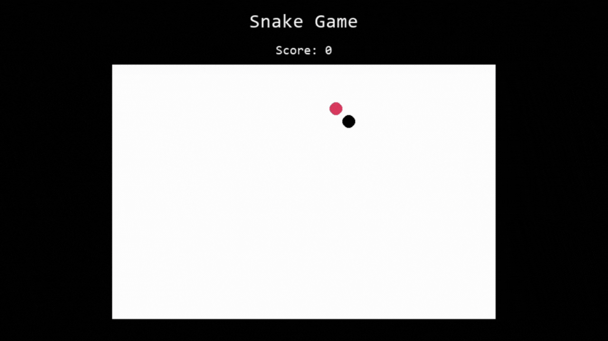

# Snake Game

## Description
This is a classic Snake game implemented using Pygame. The player controls a snake that moves around the screen, eating food to grow bigger. The game ends if the snake collides with the screen borders or itself.

## Features
- **Playable Snake Game:** Navigate the snake using arrow keys.
- **Growing Snake:** Each time the snake eats food, it grows longer.
- **Game Over Screen:** Displays when the snake hits the border or itself, with options to retry or quit.
- **Food Placement:** Ensures food does not appear at random places inside the play-screen.

## How to play the Game? 

Make sure you have Python and PyGame installed then copy the code to your local computer and run it. 

**Controls:**
- Arrow Keys: Move the snake (Left, Right, Up, Down)
- R: Retry after game over
- X: Quit the game

## Game play

